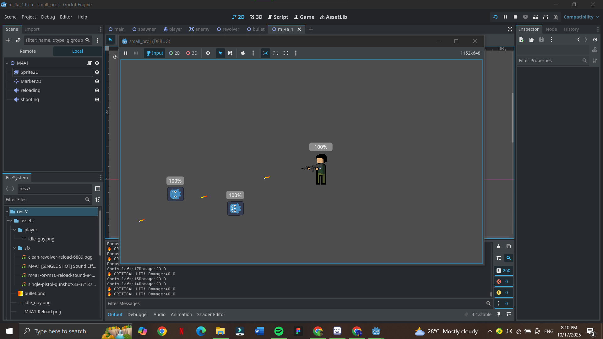

# 🧟‍♂️ Topdown Zombie Shooter

A **2D top-down zombie shooter game** where you battle endless waves of zombies!  
Survive as long as you can, unlock weapons, and fight through increasingly difficult hordes.  
This project is still **in development**, with new weapons and features being added regularly.

---

## 🎮 Gameplay

- **Objective:** Survive wave after wave of zombies.  
- **Enemies:** Zombies become faster and tougher with each wave.  
- **Weapons:** Multiple weapons available (some are still under development).  
- **Controls:**  
  - `W / A / S / D` – Move  
  - `Mouse` – Aim  
  - `Left Click` – Shoot  
  - `R` – Reload  
  - `1 / 2 / 3...` – Switch weapons  

---

## 🧰 Features

### ✅ Implemented
- Wave-based zombie spawning system  
- Player movement and shooting mechanics  
- Health and damage system  
- Weapon switching (limited selection)

### 🛠️ In Development
- New weapon types (shotguns, rifles, explosives, etc.)  
- Power-ups and upgrades  
- Improved enemy AI and animations  
- Sound effects and background music  
- Main menu and pause menu  

---

## 🚀 How to Run

1. **Clone the repository**
   ```bash
   git clone https://github.com/yourusername/your-repo-name.git
````

2. **Open the project** in your preferred game engine or IDE
   (e.g., Unity, Godot, or Java — depending on what you’re using).
3. **Run or build the game** directly from your editor.

> 💡 Tip: If your game requires additional assets or dependencies, include them in a `/resources` or `/assets` folder before running.

---

## 📸 Screenshots

<p align="center">
  
</p>


> 🧠 Tip: Keep your screenshots organized in a folder like `/assets` and name them clearly (e.g., `menu.png`, `wave1.png`).

---

## 💡 Future Plans

* Add boss waves
* Introduce player customization
* Implement multiplayer or co-op mode
* Add save/load system
* Improve graphics and UI effects
* Performance optimizations for low-end devices

---

## 🧑‍💻 Contributing

Contributions are welcome!
If you’d like to suggest a feature or fix a bug:

1. Fork the repository
2. Create a new branch (`feature/your-feature-name`)
3. Commit your changes
4. Submit a pull request

Bug reports and ideas are also welcome in the **Issues** section!

---

## 📝 License

This project is open source and available under the [MIT License](LICENSE).

---

## 👤 Author

**Your Name**
📧 [[your.email@example.com](mailto:your.email@example.com)]
🐙 [GitHub Profile](https://github.com/yourusername)

---

> 🎯 *Made with passion for zombie games — still under heavy development! Stay tuned for more updates.*

```

---

Would you like me to **fill in your actual GitHub link and name**, so it’s 100% ready to upload?
```
